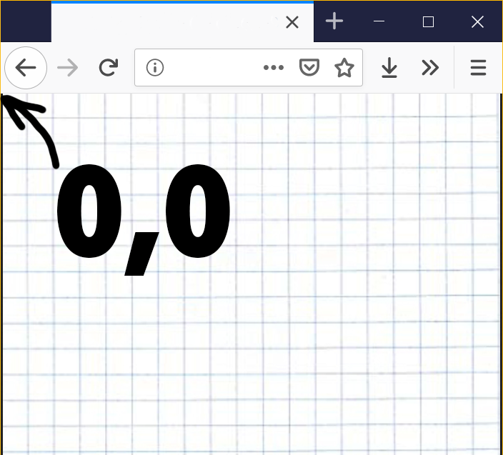

# INTRO TO P5JS

COMMENTS

```
//This is a single line comment


/*
This
is
a
multi-line
Comment
*/
```

A comment is a method of documenting your code. This is always useful not only for you, but for others who want to learn your thought process. Comments can also be useful as a debugging tool to take out or test snippets of code without having to make making big changes.

## What is a function?

A function is a way to group a set of instructions so you can use it throughout your program. Functions can take parameters which are options to make your code more modular.

## What is a library?

A library is a collection of variables, functions, and objects that work together. Libraries can be composed of one or more files.

Getting started

p5js has a basic editor for your code. You can download the editor here.

When you save your p5js project it will create a folder with your project. You will see 2 files and a libraries folder. Your libraries folder holds the p5 library as well as other libraries

When working with p5js the reference is your best friend. be one with the reference!

## STRUCTURE

### setup
```
function setup() {

}
```

The setup function runs once at the beginning of your program.


### draw

The draw function is an infinite loop that runs when a user visits your page. Code that is placed in the draw will run sequentially.

```
function draw() {

}
```

### Getting Started

```
// Global Variables

function setup(){
  //Runs once

}

function draw(){
  //Runs after setup in an infinite loop

}

```

### Using variables and scope

Variables can be declared throughout your program.

Declaring a variable means saying:

```
var num = 100;
var a = 1;
var num1 = 3;
var b = 'b'; //Character
var word1 = "word"; // String
var trueFalse = true; // Boolean
var sentences = "I'm a sentence"; // String


```

### Printing/Debugging

To find out what your variables are doing throughout your code use:

console.log(VARIABLE);

Remember that if you run console.log in the draw loop, it will keep printing your variable infinitely.

### Variables and Scope

When declaring a variable location of where the variable is declared is important. If a variable is declared with in a function, that variables scope is only available in that function. Meaning you can only use that variable in that function. For example, this code wont work:

```
function setup() {
  var test = 100;

  console.log(num);
  // The reference value for num is not available in the setup() block
}

function draw() {
    var num = 200;

    console.log(test);
    // The reference value for test is not available in the draw() block


}
```

This code will not work for 2 reasons:

The variable num is only available inside the draw function, so setup has no idea when you want to print num what variable num you are talking about.
The variable test is only available inside the setup function, so the draw has no idea when you want to print test, what variable you are referring to.
When we want to declare variables that are available through out the program we declare them at the top of our program code. This is making the variable globally available to all functions. For example:

```
var num = 200;

function setup() {

  console.log(num);

}

function draw() {

    console.log(num);

}
```

In this example, num will be printed once in the setup and infinitely in the draw loop.

## Basic Drawing

#### [createCanvas](https://p5js.org/reference/#/p5/createCanvas)

createCanvas(w,h,[renderer])

createCanvas function allows to set a size for your canvas element. It takes in 2 or 3 parameters. You can enter just a width and hieght or width, height, and render.

p5js uses 2 rendering types: P2D vs WEBGL. P2D is generally used for 2d animation. WEBGL is used for 3D animation.

#### [background()](https://p5js.org/reference/#/p5/background)

Background function allows you to add a color to your canvas. The background can be set in the setup and the draw. In the setup, the background color will set once. If placed in the draw loop, the background will reset your canvas every draw cycle.


```
// Grayscale integer value
background(51);

// R, G & B integer values
background(255, 204, 0);

// H, S & B integer values
colorMode(HSB);
background(255, 204, 100);

// Named SVG/CSS color string
background('red');

// six-digit hexadecimal RGB notation
background('#222222');

// integer RGB notation
background('rgb(0,255,0)');

// integer RGBA notation
background('rgba(0,255,0, 0.25)');

// percentage RGB notation
background('rgb(100%,0%,10%)');

// percentage RGBA notation
background('rgba(100%,0%,100%,0.5)');

// p5 Color object
background(color(0, 0, 255));
```

#### Drawing Orientation



All drawing starts on the upper left hand corner.


#### 2D Primitives

[ellipse()](https://p5js.org/reference/#/p5/ellipse)

[rect()](https://p5js.org/reference/#/p5/rect)

[line()](https://p5js.org/reference/#/p5/line)

[point()](https://p5js.org/reference/#/p5/point)

[square()](https://p5js.org/reference/#/p5/square)

[quad()](https://p5js.org/reference/#/p5/quad)

[triangle()](https://p5js.org/reference/#/p5/triangle)

[arc()](https://p5js.org/reference/#/p5/arc)


#### [fill()](https://p5js.org/reference/#/p5/fill)

Is used the set the inner color of shapes. When fill is called all shapes after the fill will share the color.

```

function draw(){

  fill("blue");
  ellipse(200,200,50,50); // blue ellipse
  ellipse(300,200,50,50); // blue ellipse
  fill("red");
  ellipse(400,200,50,50); // red ellipse
  fill("green");
  ellipse(500,200,50,50); // green ellipse

}


```


```
// Grayscale integer value
fill(51);

// R, G & B integer values
fill(255, 204, 0);

// H, S & B integer values
colorMode(HSB);
fill(255, 204, 100);

// Named SVG/CSS color string
fill('red');

// six-digit hexadecimal RGB notation
fill('#222222');

// integer RGB notation
fill('rgb(0,255,0)');

// integer RGBA notation
fill('rgba(0,255,0, 0.25)');

// percentage RGB notation
fill('rgb(100%,0%,10%)');

// percentage RGBA notation
fill('rgba(100%,0%,100%,0.5)');

// p5 Color object
fill(color(0, 0, 255));
```

#### [stroke()](https://p5js.org/reference/#/p5/stroke)

Sets the color outer border of shapes.

```
// Grayscale integer value
stroke(51);

// R, G & B integer values
stroke(255, 204, 0);
```

#### [strokeWeight()](https://p5js.org/reference/#/p5/strokeWeight)

Sets the thickness of the shapes border in pixels


#### [text()](https://p5js.org/reference/#/p5/text)

Sets the location and display of output text

```
textSize(32);
text('word', 10, 30);

```
#### [textSize()](https://p5js.org/reference/#/p5/textSize)

Sets the size of output text

#### Color

You can set color as a variable.

var c = color(255, 204, 0);


#### width and height

width and height are built in variables that give you access to the dimensions of the canvas
